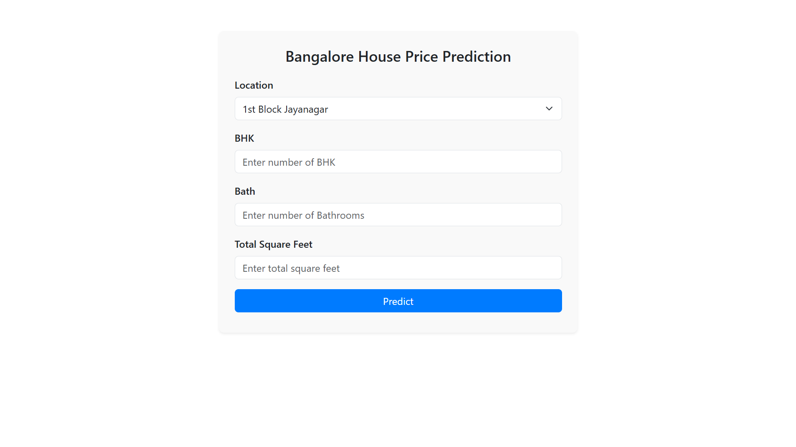
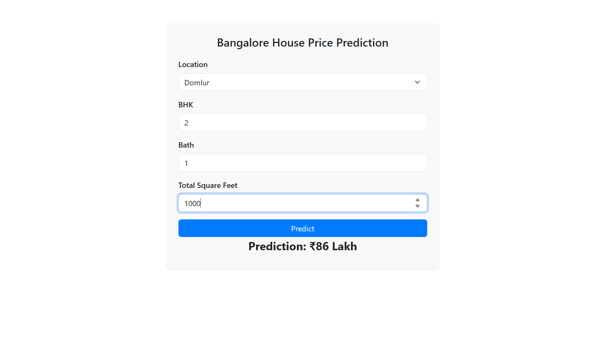
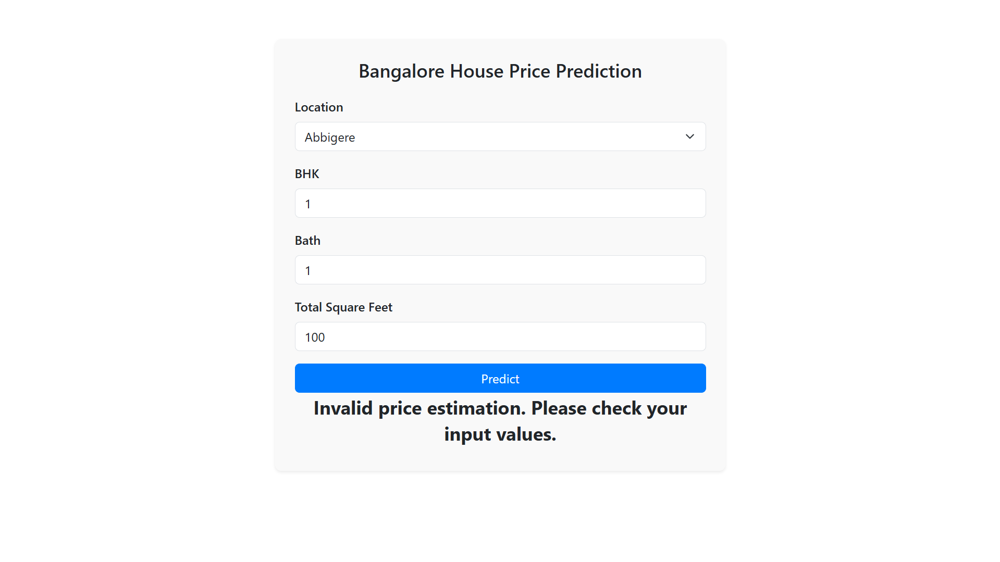

# Bangalore House Price Prediction

A machine learning project to predict house prices in Bangalore based on various factors like location, size, number of rooms, etc. The project uses different machine learning algorithms for price prediction and applies data preprocessing techniques to clean and transform the data.

## Table of Contents

- [Project Overview](#project-overview)
- [Technologies Used](#technologies-used)
- [Data Description](#data-description)
- [Modeling](#modeling)
  - [Linear Regression](#linear-regression)
  - [Lasso Regression](#lasso-regression)
  - [Ridge Regression](#ridge-regression)
- [Steps to Run the Project](#steps-to-run-the-project)
- [Usage](#usage)
- [Contributing](#contributing)
- [License](#license)
- [Acknowledgements](#acknowledgements)

## Project Overview

This project is focused on predicting house prices in Bangalore based on historical data that includes multiple features such as the size of the house, location, number of rooms, and other relevant factors. The data is cleaned, outliers are removed, and various machine learning algorithms are applied for price prediction. The goal is to predict the house price accurately based on given features.

## Technologies Used

- **Python**: The primary programming language used.
- **Pandas**: For data manipulation and analysis.
- **NumPy**: For numerical operations.
- **Scikit-learn**: For machine learning models and preprocessing techniques.
- **Matplotlib/Seaborn**: For data visualization.
- **Jupyter Notebook**: For interactive coding and testing.





## Data Description

The dataset contains information about houses in Bangalore, with features such as:

- **location**: The locality or neighborhood of the house.
- **size (sqft)**: The size of the house in square feet.
- **bathrooms**: The number of bathrooms.
- **bedrooms**: The number of bedrooms.
- **price**: The price of the house (target variable).

The dataset is cleaned by handling missing values, encoding categorical variables (like location), removing outliers, and scaling the numerical features.

### Data Preprocessing

1. **Handling Missing Data**: Removed or imputed missing values.
2. **Feature Encoding**: Categorical features like location are encoded using `OneHotEncoder`.
3. **Outlier Removal**: Applied a method to remove outliers based on `price_per_sqft` for each location.

## Modeling

### Linear Regression

Linear regression is applied as a baseline model to predict house prices. The model assumes a linear relationship between the features and the target variable (price).

- **Performance**: Achieved an R-squared value of 0.78.

### Lasso Regression

Lasso regression (L1 regularization) is used to reduce the complexity of the model by performing feature selection. It helps in eliminating less relevant features.

- **Performance**: Achieved an R-squared value of 0.77.

### Ridge Regression

Ridge regression (L2 regularization) is another regularization technique used to deal with multicollinearity by shrinking the coefficients of less important features.

- **Performance**: Achieved an R-squared value of 0.78.

### Model Comparison

- **Linear Regression**: R-squared = 0.78
- **Lasso Regression**: R-squared = 0.77
- **Ridge Regression**: R-squared = 0.78

The models are evaluated using the R-squared metric, which measures how well the model fits the data. In this case, Ridge and Linear Regression provide the best results.

## Steps to Run the Project

1. **Clone the Repository**:
   ```bash
   git clone https://github.com/yatinkashyap1252/Banglore_house_prediction.git
   cd Banglore_house_prediction
Install Dependencies: Create a virtual environment and install the necessary libraries.

bash
Copy
python3 -m venv venv
source venv/bin/activate  # For Linux/Mac
venv\Scripts\activate     # For Windows
pip install -r requirements.txt
Run the Notebook: Open and run the Banglore_House_Price_Prediction.ipynb notebook in Jupyter Notebook.

Run the Python Script: Alternatively, you can run the Python script:

bash
Copy
python house_price_prediction.py
Train the Model: The script will load the dataset, clean it, train the machine learning models, and save the best model (RidgeModel.pkl) for future use.

Usage
Once the model is trained and saved, you can use it for predicting house prices based on new data. Load the model using pickle and input the required features for prediction.

Example:

python
Copy
import pickle

# Load the model
model = pickle.load(open('RidgeModel.pkl', 'rb'))

# Example prediction (Assuming X_new is the input features in the same format as training data)
predicted_price = model.predict(X_new)
print(predicted_price)
Contributing
Feel free to fork the repository, submit issues, and create pull requests. If you'd like to contribute to this project, follow these steps:

Fork the repository

Create a new branch

Make your changes and commit them

Push to your forked repository

Submit a pull request

License
This project is licensed under the MIT License - see the LICENSE file for details.

Acknowledgements
The dataset was obtained from Kaggle (or any other source if applicable).

The machine learning models were implemented using scikit-learn.
